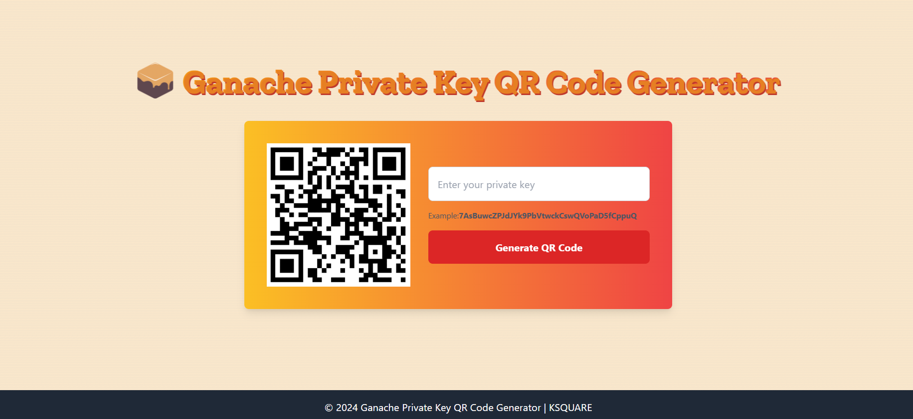

# 🎉 Ganache Private Key QR Code Generator 🎉

 

Welcome to the **Ganache Private Key QR Code Generator**! This web application allows users to generate QR codes from private keys securely. With a user-friendly interface and beautiful animations, creating and downloading QR codes has never been easier! 🚀

## Features 🌟
- Generate QR codes from your private keys 🔑
- Download QR codes as PNG images 📥
- Eye-catching animations for a better user experience ✨
- Responsive design for mobile and desktop users 📱💻

## Table of Contents 📚
- [Technologies Used](#technologies-used)
- [Demo](#demo)
- [Installation](#installation)
- [Usage](#usage)
- [Contributing](#contributing)
- [License](#license)

## Technologies Used 🛠️
- HTML5
- CSS3
- JavaScript (jQuery)
- Tailwind CSS
- QR Code Generator Library

## Demo 🎥
Check out the live demo of the application [here](https://nayakunal30.github.io/Ganache-QR-Code-Generator/) 👈

## Installation 💻
To run this project locally, follow these steps:

1. **Clone the repository:**
   ```bash
   git clone https://github.com/yourusername/ganache-qr-code-generator.git
2 . Open the index.html file in your web browser.

You can also use a live server extension if you have one installed.

Usage 📖
Enter your ganache private key in the input field. 🔑
Example: 7AsBuwcZPJdJYk9PbVtwckCswQVoPaD5fCppuQ
Click the "Generate QR Code" button. 🔘
The QR code will appear below the button. 🖼️
Click the "Download QR Code" link to save it as a PNG file. 📥
Contributing 🤝
We welcome contributions! If you would like to contribute to this project, please follow these steps:

Fork the repository.
Create a new branch (git checkout -b feature-branch).
Make your changes and commit them (git commit -m 'Add a new feature').
Push to the branch (git push origin feature-branch).
Open a pull request.


License 📄
This project is licensed under the MIT License - see the LICENSE file for details.

Thank you for checking out the Ganache Private Key QR Code Generator! If you have any questions, feel free to reach out! 😊

With love, Kunal ❤️
